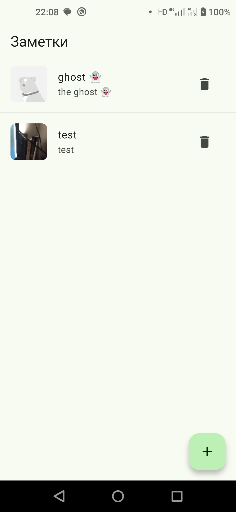

# Тестовое задание: Dog Journal (лайт)

|                      |                      |
| -------------------- | -------------------- |
|  |  |

Создайте простое Flutter-приложение, в котором можно:

## Функциональные требования

1. **Добавлять заметку:**

   - Заголовок (текст)
   - Комментарий (текст)
   - Фото из галереи

2. **Сохранять записи локально** (например, через Hive или SharedPreferences)

3. **Отображать список всех записей** (с заголовком и превью фото)

## Требования

- Простой, но аккуратный интерфейс
- Структурированный, понятный код (архитектура на ваш выбор, BLoC приветствуется)
- Можно без дизайна — важна функциональность
- Результат — GitHub или архив

```bash
flutter pub run build_runner build --delete-conflicting-outputs
```
